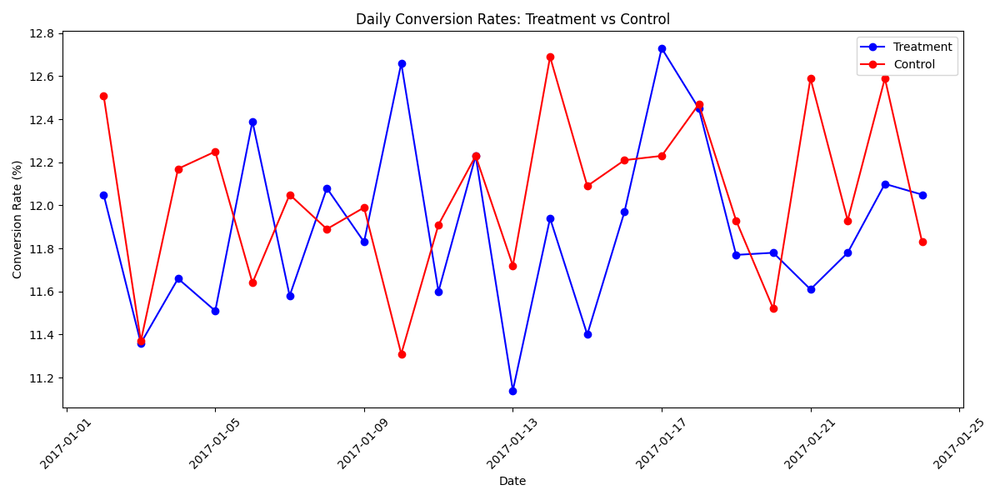
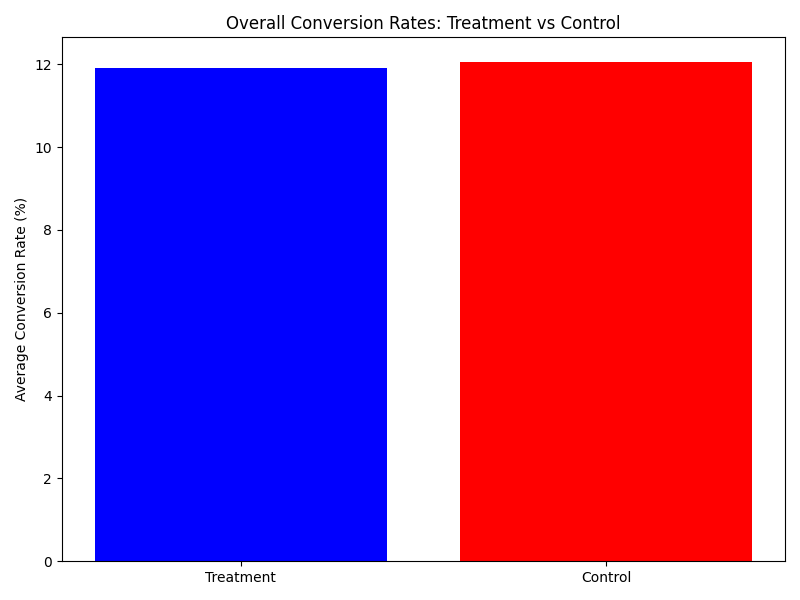
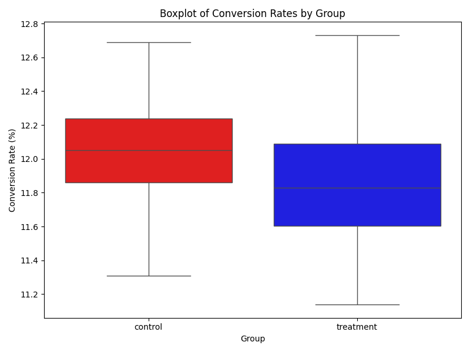

📊 AB Testing Analytics – Python, SQL & Statistics

Project Overview : 
This project analyzes the results of an A/B test experiment for a website, comparing two landing pages:
	•	Control group → Old page
	•	Treatment group → New page

The goal is to determine whether the new page improves user conversion rates compared to the old one.

Tools & Tech Stack :
•	PostgreSQL → Data storage, cleaning with SQL views, daily metrics.
•	Python (Pandas, Matplotlib, Seaborn, SciPy) → EDA, visualization, statistical testing.
•	GitHub → Version control, project documentation.

Project Structure :
ab_testing_analytics/
│── data/
│   ├── raw/          # Original CSV files (ab_data, countries)
│   ├── processed/    # Cleaned & aggregated datasets (daily_stats.csv, etc.)
│
│── sql/              # SQL scripts (DDL, cleaning, joins, daily stats)
│── src/              # Python scripts (data loading, EDA, testing)
│── figures/          # Plots & visualizations
│── README.md         # Project documentation
│── requirements.txt  # Tools to use

Steps & Methodology :
1.	Data Loading
	•	Loaded raw CSVs into PostgreSQL (raw_ab_data, raw_countries).
	•	Created SQL views (ab_data_clean, countries_clean, ab_user_country) for cleaned data.
2.	Exploratory Data Analysis (EDA)
	•	Daily conversion rate trends for both groups.
	•	Overall conversion rates comparison.
	•	Histograms & bar charts for group differences.
3.	Statistical Testing
	•	Conducted z-test for proportions to check significance.
	•	Null Hypothesis (H0): No difference in conversion rates.
	•	Alternative Hypothesis (H1): Treatment group has a higher conversion rate.

Key Results :
	•	Control group CR: ~12.0%
	•	Treatment group CR: ~11.9%
	•	Z-score: ~1.24
	•	P-value: ~0.21 (> 0.05)

Conclusion: There is no statistically significant difference between the old and new page.
Recommendation: Keep the old design, since the new one doesn’t improve conversions.

Sample Visuals : 

